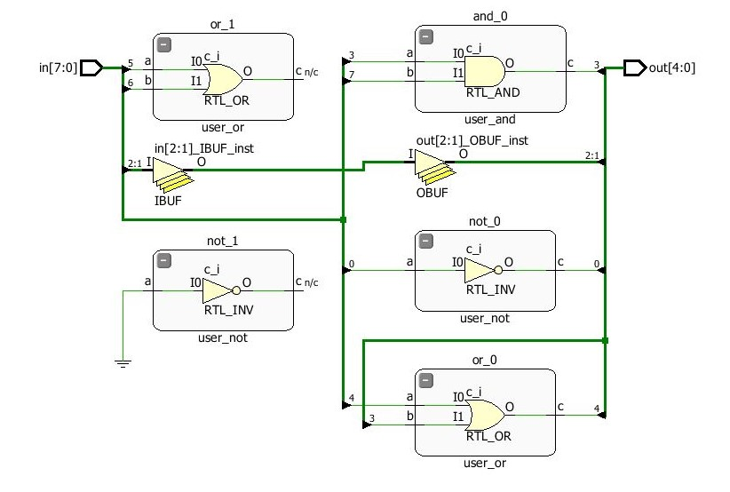

# Logical-Modules-in-Verilog
Logical modules realization in Verilog (Vivado Env)

## Purpose: to develop a top-level module, to study the possibility of connecting several modules in a project. Analysis of delays and testing of the finished module on the board.
Principle of connecting modules on Verilog:
- Creating primitives (AND, OR, NOT modules);
- Creating a higher level module;
- At the top level, specify the name of the module of the instance you are looking for;
- Writing the name of that particular instance of the module;
- Description of signal connections: a dot followed by the name of the module's signal, then in parentheses the name of the wire that is connected to it.

RTL simulation of the electrical logical schema:

#

Time diagram: 

